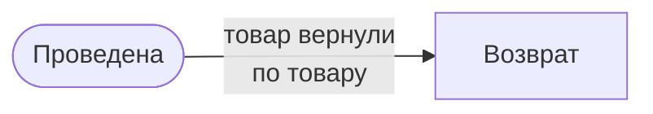
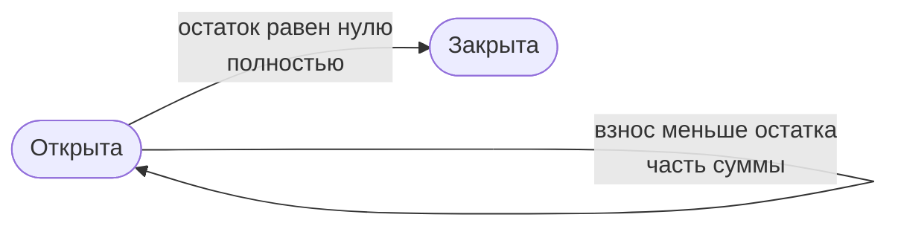
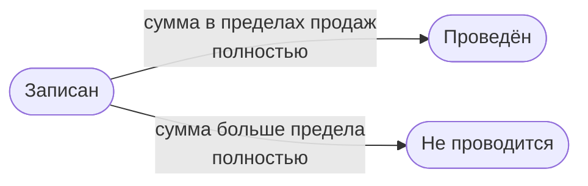

---
covers:
  - src/configuration/goods.ts
  - src/configuration/documents/sale.document.ts
  - src/configuration/documents/installment.document.ts
  - src/configuration/documents/weighing.document.ts
  - src/configuration/documents/refund.document.ts
---

# Правила учёта

Раздел содержит бизнес-правила магазина: формулы, округление, условия и запреты. Устройство платформы, состав полей, раскладку форм и порядок работы сотрудников он не описывает. Правила добавляются вместе с документами, которые им подчиняются.

## Как читать схемы

У каждого документа ниже своя схема состояний и переходов. Овал обозначает состояние, прямоугольник обозначает другой документ. Пометка под названием перехода показывает, что именно переходит:

- «по товару»: отдельная строка товара, остальные строки документа остаются как были;
- «полностью»: документ целиком.

Каждый из четырёх документов относится к смене, в которой оформлен. Продажа из отвеса может прийтись на другую смену, чем сам отвес.

## Суммы

- Деньги считаются в копейках.
- Скидка строки задаётся процентом от 0 до 100 с точностью до двух знаков.
- Итог строки равен стоимости, уменьшенной на процент скидки: `итог = стоимость × (100 − скидка) / 100`.
- Итог строки округляется до копейки по арифметическому правилу: половина копейки округляется вверх.
- Сумма документа равна сумме итогов строк и повторно не округляется.

Так же считает 1С, поэтому суммы совпадают с ней до копейки.

| Стоимость | Скидка | До округления | Итог |
|---|---|---|---|
| 10,10 ₽ | 5 % | 9,595 ₽ | 9,60 ₽ |
| 999,99 ₽ | 15 % | 849,9915 ₽ | 849,99 ₽ |

Сумма документа с этими двумя строками равна 859,59 ₽.

## Продажа

Продажа при возврате не меняется. Товары по ней можно возвращать несколькими возвратами, пока их общая сумма не достигла суммы продажи.

- Продажа относится к смене.
- Сумма продажи равна сумме итогов её товаров.
- Продажа, рассрочка и отвес учитываются раздельно: суммы рассрочек и отвесов в сумму продаж не входят.

## Рассрочка

Рассрочка записывает товар, который оплачивают взносами. Она ведётся отдельно от продаж: продажей не становится и возвратом не уменьшается.

- Сумма рассрочки равна сумме итогов её товаров.
- Остаток равен сумме рассрочки за вычетом суммы взносов.
- Взнос не может превышать остаток.
- Рассрочку можно закрыть, только когда остаток равен нулю.
- Закрытая рассрочка не изменяется и взносов не принимает.

## Отвес

Отвес записывает товар, отложенный для покупателя. Выкупленные товары копируются в новую продажу. Отвес закрывается сам, когда каждая его строка продана или вывешена.

- Строка товара находится в одном из трёх состояний: «В отвесе», «Продано», «Вывешено».
- «Продано» означает, что строку закрыл документ продажи; строка на него ссылается.
- «Вывешено» означает, что товар вернулся в зал без продажи.
- Продажа из отвеса является самостоятельным документом со своей датой и сменой. Товары в неё копируются, и её изменение отвес не меняет.
- Продажа из отвеса относится к смене, открытой в момент оформления. Без открытой смены она не оформляется.
- Остаток отвеса равен сумме итогов строк «В отвесе».
- Отвес закрыт, когда строк «В отвесе» не осталось.

## Возврат

Проведённый возврат уменьшает сумму, которую ещё можно вернуть по его продажам. Других переходов у возврата нет.

- Строка возврата ссылается на продажу.
- По каждой продаже сумма итогов строк всех проведённых возвратов вместе с проводимым не превышает суммы этой продажи.
- Ограничение действует на сумму, а не на отдельные товары.
- Возврат не изменяет документ продажи.

Пример: по продаже на 1 000 ₽ проведён возврат на 600 ₽. Второй возврат на 500 ₽ не проводится, на 400 ₽ проводится.
