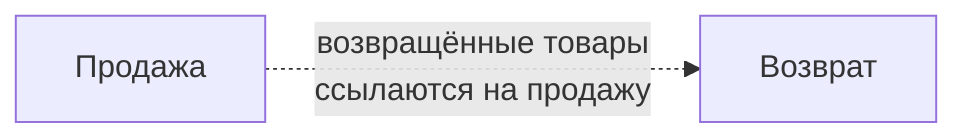
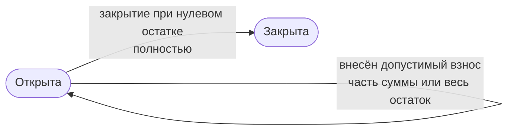
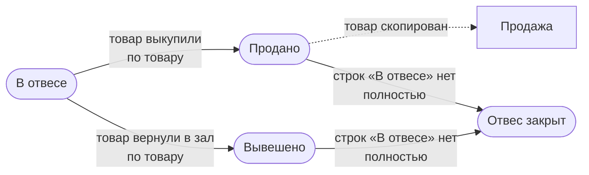
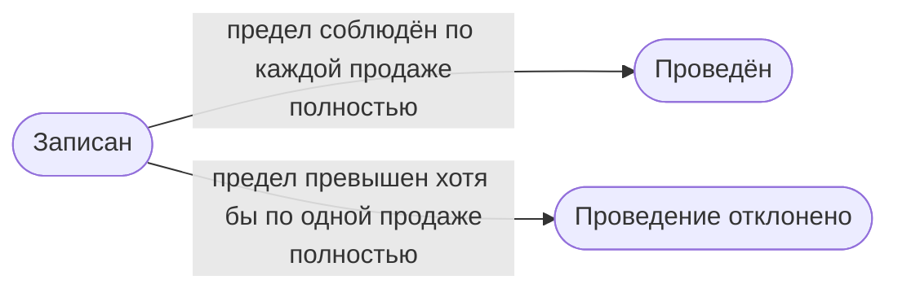

---
covers:
  - src/configuration/goods.ts
  - src/configuration/documents/sale.document.ts
  - src/configuration/documents/installment.document.ts
  - src/configuration/documents/weighing.document.ts
  - src/configuration/documents/refund.document.ts
---

# Правила учёта

Справочник предназначен для проверки расчётов и условий учёта магазина. Он описывает суммы, скидки, состояния документов и ограничения операций. Устройство платформы, состав полей, формы и порядок работы сотрудников описываются отдельно.

## Общие правила

Продажа, рассрочка, отвес и возврат относятся к смене, в которой оформлены. Продажа, созданная из отвеса, имеет собственную дату и смену: она может относиться к другой смене, чем исходный отвес.

Продажи, рассрочки и отвесы учитываются раздельно. Суммы рассрочек и отвесов не входят в сумму продаж. Выкуп товара из отвеса создаёт самостоятельную продажу, а оплата рассрочки продажу не создаёт.

Возврат относится к продажам, указанным в его строках. Он ограничивает сумму последующих возвратов, но не изменяет исходные продажи и не уменьшает рассрочки.

## Суммы

Для товаров продажи, рассрочки, отвеса и возврата действует один расчёт:

| Величина | Правило |
|---|---|
| Деньги | Считаются в копейках |
| Стоимость строки | Неотрицательная сумма до скидки |
| Скидка строки | Процент от 0 до 100 с точностью до двух знаков |
| Итог строки до округления | `стоимость × (100 − скидка) / 100` |
| Округление итога | До копейки по арифметическому правилу: половина копейки округляется вверх |
| Сумма строк | Складываются уже округлённые итоги; повторного округления нет |

Примеры расчёта:

| Стоимость | Скидка | До округления | Итог |
|---|---|---|---|
| 10,10 ₽ | 5 % | 9,595 ₽ | 9,60 ₽ |
| 999,99 ₽ | 15 % | 849,9915 ₽ | 849,99 ₽ |

Сумма этих двух строк равна 859,59 ₽. Правило описывает расчёт приложения. Совпадение с конкретной конфигурацией 1С требует отдельной сверки её формул и порядка округления.

## Как читать схемы

Схемы показывают состояния и связи документов. Овал обозначает состояние, прямоугольник обозначает связанный документ. Подпись стрелки называет действие или условие:

- «по товару»: меняется отдельная строка, остальные строки документа сохраняют свои состояния;
- «полностью»: действие или проверка относится к документу целиком;
- пунктирная стрелка: связь с другим документом.

У отвеса состояния «В отвесе», «Продано» и «Вывешено» относятся к строкам товаров; состояние «Отвес закрыт» относится ко всему документу.

## Продажа

Продажа учитывает проданные товары. Возвраты по продаже оформляются отдельными документами: исходная продажа при этом не меняется.

| Правило | Условие или расчёт |
|---|---|
| Сумма продажи | Сумма итогов её товаров |
| Несколько возвратов | Допустимы, пока их общая сумма по этой продаже не превышает сумму продажи |
| Продажа из отвеса | Самостоятельный документ; изменение продажи не меняет исходный отвес |

Предел проверяется по сумме продажи, а не по отдельным товарам. Полное правило и пример приведены в разделе [«Возврат»](#возврат).

## Рассрочка

Рассрочка учитывает товары, которые покупатель оплачивает взносами. Она не превращается в продажу ни при внесении платежа, ни при закрытии.

| Правило | Условие или расчёт |
|---|---|
| Сумма рассрочки | Сумма итогов её товаров |
| Остаток | `сумма рассрочки − сумма взносов` |
| Взнос | Положительная сумма не больше остатка |
| Закрытие | Допустимо только при нулевом остатке |
| Закрытая рассрочка | Не изменяется, не принимает взносов и не помечается на удаление |

Нулевой остаток разрешает закрытие, но не закрывает рассрочку автоматически. Например, для рассрочки на 1 000 ₽ после взноса 600 ₽ остаток составляет 400 ₽. Взнос 500 ₽ отклоняется. После взноса 400 ₽ рассрочку можно закрыть; после закрытия изменить её нельзя.

## Отвес

Отвес учитывает товары, отложенные для покупателя. Каждая строка имеет своё состояние, поэтому часть товаров можно выкупить, а остальные оставить в отвесе или вернуть в зал.

| Состояние строки | Значение |
|---|---|
| В отвесе | Товар остаётся отложенным для покупателя |
| Продано | Товар включён в продажу, созданную из этого отвеса; строка ссылается на эту продажу |
| Вывешено | Товар вернулся в зал без продажи; ссылки на продажу нет |

| Правило | Условие или расчёт |
|---|---|
| Выкуп | Продать можно строки в состоянии «В отвесе»; выбранные товары копируются в новую продажу |
| Связь с продажей | Ссылка на продажу допустима только у строки «Продано»; продажа должна быть оформлена из этого отвеса |
| Смена продажи | Используется смена, открытая в момент выкупа; без открытой смены продажа не оформляется |
| Остаток | Сумма итогов строк «В отвесе» |
| Закрытие | Происходит автоматически, когда строк «В отвесе» не осталось |

Закрытие определяется состояниями строк, а не нулевым остатком: товар с нулевой стоимостью тоже может оставаться в отвесе. Например, в отвесе два товара на 600 ₽ и 400 ₽. После выкупа первого создаётся продажа на 600 ₽, а остаток отвеса равен 400 ₽. Если второй товар вывешен, отвес закрывается. Последующее изменение продажи отвес не меняет.

## Возврат

Возврат учитывает товары, возвращённые по одной или нескольким продажам. Каждая его строка ссылается на свою продажу; предел проверяется отдельно по каждой продаже.

| Правило | Условие или расчёт |
|---|---|
| Сумма возврата по продаже | Сумма итогов строк возврата, ссылающихся на эту продажу |
| Доступная сумма по продаже | `сумма продажи − сумма уже проведённых возвратов по ней` |
| Предел | Сумма проверяемого возврата по каждой продаже не больше доступной суммы |
| Проверка предела | При проведении и при изменении уже проведённого возврата; непроведённый возврат сохраняется без этой проверки |
| Единица ограничения | Сумма по продаже, а не отдельный товар |
| Исходная продажа | Возврат её не изменяет |

Проведённый возврат уменьшает доступную сумму последующих возвратов. При изменении проведённого возврата его новые суммы заменяют прежние в расчёте предела, а не прибавляются к ним.

Например, по продаже на 1 000 ₽ проведён возврат на 600 ₽. Ещё можно вернуть 400 ₽: второй возврат на 500 ₽ не проводится, а на 400 ₽ проводится. Если в документе есть строки по нескольким продажам, превышение предела хотя бы по одной из них отклоняет проведение всего возврата.
